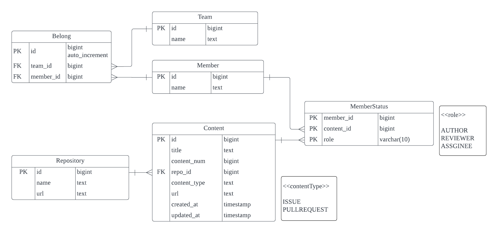

# github-crawling

Client팀과 Server팀 팀원들의 Github History를 Reporting하는 프로젝트

## Requirements

- Python 3.9.7
- MySQL 8.0.32

## Structure

```
github-crawling
 ┣ docs
 ┃ ┗ github_crawling_erd.png
 ┣ src
 ┃ ┣ schema.sql                       -> 테이블 생성 쿼리
 ┃ ┣ get_issue.py                     -> 이슈 목록 불러오는 메소드 모음
 ┃ ┣ get_pr.py                        -> PR 목록 불러오는 메소드 모음
 ┃ ┣ initial_set.py                   -> 실행 시 처음 처리 되어야 하는 부분
 ┃ ┣ insert_content_last_week.py      -> 현재 날짜 기준으로 지난 하루의 이슈 및 PR 목록 저장
 ┃ ┣ insert_content_last_week.py      -> 현재 날짜 기준으로 지난 주의 이슈 및 PR 목록 저장
 ┃ ┣ insert_db.py                     -> DB에 저장하는 메소드 모음
 ┃ ┗ insert_member_and_team.py        -> 팀, 멤버를 저장하거나 업데이트
 ┣ .gitignore
 ┣ README.md
 ┗ requirements.txt
```

## Quick Start

1. git clone

   ```
   git clone https://github.com/dalcomsoft/github-crawling.git
   cd github-crawling
   ```

2. pip install

   ```
   pip install -r requirements.txt
   ```

3. mysql setting (for mac)

   설치

   ```
   brew install mysql
   ```

   mysql 데몬 실행

   ```
   brew services start mysql
   ```

   최초 실행시 root 패스워드 설정

   ```
   mysqladmin -u root -p password [패스워드]
   ```

   MySQL 접속

   ```
   mysql -u root -p
   ```

   설정한 패스워드 입력

   사용자 설정, db 사용 설정

   ```
   create user 'github_crawler'@'localhost' identified by 'crawling';
   create database github_crawling;
   grant all privileges on github_crawling.* to 'github_crawler'@'localhost' with grant option;
   flush privileges;
   use github_crawling;
   ```

   테이블 생성

   ```
   source [github-crawling/schema.sql의 절대경로];
   ```

4. initial_set.py에 토큰 설정하기

   ```
   access_token = '엑세스토큰'
   ```

5. 멤버 정보 저장

   ```
   python3 src/update_member_and_team.py
   ```

6. 최근 일주일 기록 저장
   ```
   python3 src/insert_content_last_week.py
   ```

## ERD


